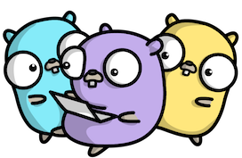

### Hi there，I'm [Snowlyg!](https://github.com/snowlyg) 👋 👋

<!--
**snowlyg/snowlyg** is a ✨ _special_ ✨ repository because its `README.md` (this file) appears on your GitHub profile.

Here are some ideas to get you started:

- 🔭 I’m currently working on ...
- 🌱 I’m currently learning ...
- 👯 I’m looking to collaborate on ...
- 🤔 I’m looking for help with ...
- 💬 Ask me about ...
- 📫 How to reach me: ...
- 😄 Pronouns: ...
- ⚡ Fun fact: ...
-->

My main programming languages are:

  - Go(lang)

My second programming languages are:

  - PHP
  - JS
  
  If you have an interesting job write me by email or skype deepweb2
  

<!--

Loved the project? Please consider <a href="https://www.paypal.me/snowlyg">donating</a> to help it improve!
-->

