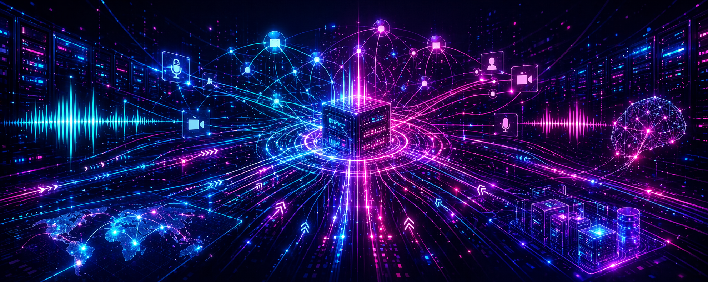

 
 

 
 

 
 

 

<table>
  <tr>
    <td align="center" width="33%">
      <h3>NOW BUILDING</h3>
      <strong>RTC Call Gateway</strong>
      
Go + Pion WebRTC gateway infrastructure for real-time audio/video and AI-ready media streams.

    </td>
    <td align="center" width="33%">
      <h3>CORE FOCUS</h3>
      <strong>Weak-Network Reliability</strong>
      
Signaling, session lifecycle, coturn relay behavior and long-running call stability under unstable networks.

    </td>
    <td align="center" width="33%">
      <h3>SYSTEM LAYER</h3>
      <strong>Media + Backend</strong>
      
FFmpeg workflows, WebRTC audio debugging, gRPC, WebSocket, MQTT and real-time event pipelines.

    </td>
  </tr>
</table>

## CORE POWERS

<table>
  <tr>
    <td width="50%" valign="top">
      <h3>WebRTC Production Debugging</h3>
      
Weak-network behavior, coturn relay issues, Android WebRTC stability, ICE/STUN/TURN paths and call quality problems.

    </td>
    <td width="50%" valign="top">
      <h3>RTC Gateway Architecture</h3>
      
Signaling services, session orchestration, Pion WebRTC integration, gRPC/WebSocket/MQTT event flow and lifecycle control.

    </td>
  </tr>
  <tr>
    <td width="50%" valign="top">
      <h3>AI-Ready Audio / Media Engineering</h3>
      
WebRTC audio 3A, AEC dump analysis, FFmpeg pipelines, RTP/RTSP/RTMP/HLS workflows and audio processing foundations.

    </td>
    <td width="50%" valign="top">
      <h3>Go Backend Stability</h3>
      
Concurrent services, production deadlock analysis, distributed backend coordination and infrastructure reliability.

    </td>
  </tr>
</table>

## FEATURED WORK

<table>
  <tr>
    <td width="34%" valign="top">
      <h3>Call Gateway</h3>
      
Production-oriented RTC gateway work for signaling, session orchestration, Pion WebRTC integration and weak-network testing.

    </td>
    <td width="33%" valign="top">
      <h3>GoEasyFfmpeg</h3>
      
Go-based media processing service for FFmpeg orchestration, streaming task control and RTMP/RTSP/HLS/FLV workflows.

    </td>
    <td width="33%" valign="top">
      <h3>WebRTC Research Notes</h3>
      
Practical notes from WebRTC networking, Android call stability, coturn, audio debugging and production incident analysis.

    </td>
  </tr>
</table>

## RESEARCH DROPS

- [WebRTC stability in complex LAN environments](https://emphasized-burst-0c5.notion.site/111e8b936fa681519c28c6cde831ff89)
- [Android 14 WebRTC call disconnection analysis with coturn](https://emphasized-burst-0c5.notion.site/Android14-coturn-2fee8b936fa680daba3cc30dc25d782d?pvs=73)
- [Debugging Android WebRTC audio 3A using AEC_DUMP](https://emphasized-burst-0c5.notion.site/AEC_DUMP-WEBRTC-3A-292e8b936fa68051a79bfbc385d27cfa?pvs=73)
- [Debugging a Golang production deadlock issue](https://emphasized-burst-0c5.notion.site/Golang-1d3e8b936fa6809eb9b0e777dcf7e435)

<table align="center">
  <tr>
    <td align="left" valign="top" width="25%">
      
      
<strong>RTC gateway</strong>

    </td>
    <td align="left" valign="top" width="25%">
      
      
<strong>followers</strong>

    </td>
    <td align="left" valign="top" width="25%">
      
      
<strong>repos</strong>

    </td>
    <td align="left" valign="top" width="25%">
      
      
<strong>stars</strong>

    </td>
  </tr>
  <tr>
    <td align="left" valign="top" width="25%">
      
      
<strong>call gateways</strong>

    </td>
    <td align="left" valign="top" width="25%">
      
      
<strong>debugging</strong>

    </td>
    <td align="left" valign="top" width="25%">
      
      
<strong>audio / FFmpeg</strong>

    </td>
    <td align="left" valign="top" width="25%">
      
      
<strong>Pion · gRPC · MQTT</strong>

    </td>
  </tr>
</table>

<strong>Open to WebRTC, RTC infrastructure and Go backend conversations.</strong>

 
 

Email: <a href="mailto:brendenaudrina6287@gmail.com">brendenaudrina6287@gmail.com</a> · Twitter: <a href="https://twitter.com/rodin990">@rodin990</a>

